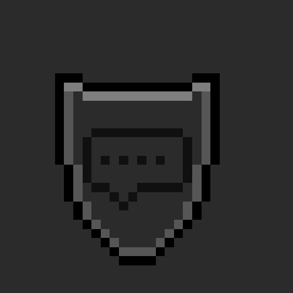

<a id="readme-top"></a>

## ChatGuard
> Protect your chat for free!
`Project by GlitchDetected`
---

Core Philosophy
| Path                    | Description        |
| ----------------------- | ------------------ |
| `./src/commands`             | Includes all the commands for the bot (slash & prefix cmds) |
| `./src/events`                 | Includes the command & event handler |

  <a href="https://github.com/GlitchDetected/ChatGuard">
    
  </a>

---

**Fill in the environment variables before running or else...**

<details>
  <summary>Table of Contents</summary>
  <ol>
    <li>
      <a href="#ChatGuard">Some core philosophy</a>
      <ul>
        <li><a href="#built-with">Built With</a></li>
      </ul>
    </li>
    <li>
      <a href="#setup">Setup</a>
      <a href="#deploy">Deploy</a>
      <a href="#pulling-changes">pull the changes</a>
    </li>
    <li><a href="#contributing">Contributing</a></li>
    <li><a href="#license">License</a></li>
  </ol>
</details>

### Built With

* [![Rust][Rust]][Rust-url]
* [![Typescript][Typescript]][Typescript-url]
* [![React][React.js]][React-url]

<p align="right">(<a href="#readme-top">back to top</a>)</p>

## Features
- Support User State
- Support Graceful Shutdown when Bot Receives the Signal Interrupt
- Some random slash and prefix commands
- Event handler

## setup

This is how you run the bot
* install rust at (https://www.rust-lang.org/tools/install) if you haven't already

```env
DATABASE_URL=pgsqlconnectionstring
DISCORD_TOKEN=botoken
```

- cargo run

- you can always do `cargo clean` to clean out the target directory

See the [open issues](https://github.com/GlitchDetected/ChatGuard/issues) for a full list of proposed features (and known issues).

<p align="right">(<a href="#readme-top">back to top</a>)</p>

## Deploy

This is how you push the code to production!

```
docker build -t chatguard .
docker compose up -d
```

## Pulling Changes
```
docker compose down
sudo git pull

docker build -t chatguard .
docker compose up -d
```

## Contributing

Contributions is what makes the open source community such an amazing place to learn, inspire, and create. Any contributions you make are **greatly appreciated**!

To contribute, please fork the repo and create a pull request. You can also simply open an issue with the tag "enhancement".
Don't forget to give the project a star!

1. Fork the Project
2. Create your Feature Branch (`git checkout -b feature/chatguardfeature`)
3. Commit your Changes (`git commit -m 'Added a new feature'`)
4. Push to the Branch (`git push origin feature/chatguardfeature`)
5. Open a Pull Request

### Top contributors:

<a href="https://github.com/GlitchDetected/ChatGuard/graphs/contributors">
  
</a>

<p align="right">(<a href="#readme-top">back to top</a>)</p>


<!-- LICENSE -->
## License

Distributed under the Unlicense License. See `LICENSE.txt` for more information.

<p align="right">(<a href="#readme-top">back to top</a>)</p>

## Resources
- https://www.postgresql.org/download/macosx/
- https://postgresapp.com/
- https://redis.io/docs/latest/operate/oss_and_stack/install/install-redis/install-redis-on-mac-os/
- https://nodejs.org/en/download
- https://www.rust-lang.org/tools/install

<p align="right">(<a href="#readme-top">back to top</a>)</p>

[contributors-shield]: https://img.shields.io/github/contributors/GlitchDetected/ChatGuard.svg?style=for-the-badge
[contributors-url]: https://github.com/GlitchDetected/ChatGuard/graphs/contributors
[forks-shield]: https://img.shields.io/github/forks/GlitchDetected/ChatGuard.svg?style=for-the-badge
[forks-url]: https://github.com/GlitchDetected/ChatGuard/network/members
[stars-shield]: https://img.shields.io/github/stars/GlitchDetected/ChatGuard.svg?style=for-the-badge
[stars-url]: https://github.com/GlitchDetected/ChatGuard/stargazers
[issues-shield]: https://img.shields.io/github/issues/GlitchDetected/ChatGuard.svg?style=for-the-badge
[issues-url]: https://github.com/GlitchDetected/ChatGuard/issues
[license-shield]: https://img.shields.io/github/license/GlitchDetected/ChatGuard.svg?style=for-the-badge
[license-url]: https://github.com/GlitchDetected/ChatGuard/blob/master/LICENSE.txt
[product-screenshot]: images/screenshot.png
[Next.js]: https://img.shields.io/badge/next.js-000000?style=for-the-badge&logo=nextdotjs&logoColor=white
[Next-url]: https://nextjs.org/
[React.js]: https://img.shields.io/badge/React-20232A?style=for-the-badge&logo=react&logoColor=61DAFB
[React-url]: https://reactjs.org/
[Rust]: https://img.shields.io/badge/rust-20232A?style=for-the-badge&logo=rust&logoColor=FFA500
[Rust-url]: https://www.rust-lang.org/
[Typescript]: https://img.shields.io/badge/typescript-20232A?style=for-the-badge&logo=typescript&logoColor=0000FF
[Typescript-url]: https://www.typescriptlang.org/